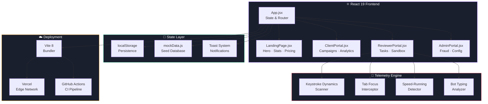

<div align="center">

# 🔬 Attentra

### Verified Human Intelligence Before You Launch.

[](LICENSE)
[](https://react.dev)
[](https://vite.dev)
[](https://attentra-three.vercel.app)
[](CONTRIBUTING.md)
[](https://github.com/thakurcodeshere/Attentra/stargazers)

<br />

**Attentra** is the world's first open-source **human attention telemetry platform** — a network of verified human reviewers that helps creators, brands, and developer teams see how real people **react**, **navigate**, and **make decisions** on their digital products.

<br />

[🚀 Live Demo](https://attentra-three.vercel.app) · [📖 Documentation](#-getting-started) · [🐛 Report Bug](https://github.com/thakurcodeshere/Attentra/issues/new?template=bug_report.md) · [✨ Request Feature](https://github.com/thakurcodeshere/Attentra/issues/new?template=feature_request.md)

<br />


</div>

<br />

## 🧠 Why Attentra?

Traditional user feedback tools rely on **self-reported surveys** where users speed-click through checkboxes to collect payment. Attentra is different:

| | Traditional Surveys | Attentra |
|---|---|---|
| **Fraud Prevention** | ❌ None — bots & spam | ✅ 98% keystroke & tab-focus intercepts |
| **Engagement Proof** | ❌ Self-reported only | ✅ Second-by-second telemetry logs |
| **Audience Targeting** | ❌ Generic panels | ✅ Verified developers, designers, gamers |
| **Analytics** | ❌ Raw spreadsheets | ✅ AI-clustered topics & click coordinates |
| **Speed** | ⏳ Days to weeks | ⚡ Results in minutes |

<br />

## ✨ Key Features

<table>
<tr>
<td width="50%">

### 🎯 For Clients (Campaign Creators)
- **3-Step Campaign Wizard** — Upload asset → Target demographics → Lock escrow & launch
- **Real-time Analytics Hub** — Second-by-second video retention charts via HTML5 Canvas
- **Click Coordinate Heatmaps** — Visual hotspot overlays on prototype mockups
- **Thumbnail A/B Split Testing** — Side-by-side preference analysis with AI summaries
- **AI-Powered Insights** — Clustered topic analysis and priority action checklists
- **REST API & Webhooks** — Rotate API keys, configure webhook endpoints, export JSON
- **Team Workspace** — Invite collaborators with role-based access control
- **Subscription Billing** — Tiered plans with full invoice history

</td>
<td width="50%">

### 🛡️ For Reviewers (Human Testers)
- **Task Marketplace** — Browse and accept available audit campaigns
- **Telemetry Sandbox** — Video player with timestamped comment logging
- **Prototype Clickmap Tool** — Interactive browser mockup with coordinate capture
- **Anti-Fraud Engine** — Real-time keystroke dynamics & tab-focus monitoring
- **Reputation System** — SVG ring progress score with achievement badges
- **Wallet & Payouts** — Earn per completed audit with transparent escrow

### 🔒 For Admins (Platform Security)
- **Fraud Intercept Registry** — Live database of flagged telemetry events
- **Threshold Configuration** — Tune minimum character lengths & validation rules
- **Speed-Running Detection** — Auto-reject submissions completed too fast
- **Bot Typing Interception** — Keystroke interval analysis to catch automation

</td>
</tr>
</table>

<br />

## 🏗️ System Architecture



<br />

## 🛠️ Tech Stack

<div align="center">

| Layer | Technology | Purpose |
|:---:|:---:|:---|
| ⚛️ | **React 19** | Component-based UI with hooks & concurrent features |
| ⚡ | **Vite 8** | Lightning-fast HMR dev server & optimized production builds |
| 🎨 | **Vanilla CSS** | Custom HSL design system with glassmorphism & micro-animations |
| 📊 | **HTML5 Canvas** | High-fidelity retention charts & click coordinate heatmaps |
| 🔍 | **ESLint 10** | Code quality enforcement with React hooks purity rules |
| ☁️ | **Vercel** | Edge-deployed production hosting with SPA routing |
| 🔄 | **GitHub Actions** | Automated CI pipeline (lint → build) on every push & PR |
| 🎭 | **Font Awesome 6** | 800+ icons across all dashboard interfaces |
| ✏️ | **Google Fonts** | Inter · Outfit · Space Grotesk · Fira Code |

</div>

<br />

## 📂 Project Structure

```
attentra/
├── .github/
│   ├── workflows/
│   │   └── ci.yml                 # Lint + Build CI pipeline
│   ├── ISSUE_TEMPLATE/
│   │   ├── bug_report.md          # Bug submission template
│   │   └── feature_request.md     # Feature proposal template
│   └── PULL_REQUEST_TEMPLATE.md   # PR checklist
│
├── src/
│   ├── main.jsx                   # React DOM mount entry point
│   ├── App.jsx                    # Global state, router, toast engine
│   ├── index.css                  # Full HSL design system (~33KB)
│   ├── data/
│   │   └── mockData.js            # Seed database & localStorage helpers
│   └── pages/
│       ├── LandingPage.jsx        # Hero, stats, ROI calc, code playground
│       ├── ClientPortal.jsx       # Campaign wizard, Canvas analytics
│       ├── ReviewerPortal.jsx     # Task feed, telemetry sandbox
│       └── AdminPortal.jsx        # Fraud logs, threshold configs
│
├── index.html                     # Vite HTML entry with CDN links
├── vite.config.js                 # Vite 8 dev server configuration
├── eslint.config.js               # ESLint flat config with React rules
├── vercel.json                    # SPA rewrite rules for Vercel
├── package.json                   # Dependencies & scripts
│
├── CODE_OF_CONDUCT.md
├── CONTRIBUTING.md
├── SECURITY.md
└── LICENSE                        # MIT License
```

<br />

## 🚀 Getting Started

### Prerequisites

- **Node.js** ≥ 18.0
- **npm** ≥ 9.0 (or **yarn** / **pnpm**)
- **Git**

### Installation

```bash
# 1. Clone the repository
git clone https://github.com/thakurcodeshere/Attentra.git
cd Attentra

# 2. Install dependencies
npm install

# 3. Start the development server
npm run dev
```

The app will be running at **http://localhost:5173** 🎉

### Available Scripts

| Command | Description |
|---|---|
| `npm run dev` | Start Vite dev server with HMR |
| `npm run build` | Create optimized production bundle in `/dist` |
| `npm run lint` | Run ESLint across all source files |
| `npm run preview` | Preview the production build locally |

<br />

## 🤝 Contributing

We love contributions! Attentra is built by the community, for the community.

Whether you're fixing a typo, adding a feature, or proposing a new architecture — **every contribution matters**.

<div align="center">

| 🐛 Found a Bug? | ✨ Have an Idea? | 📖 Improve Docs? |
|:---:|:---:|:---:|
| [Open a Bug Report](https://github.com/thakurcodeshere/Attentra/issues/new?template=bug_report.md) | [Request a Feature](https://github.com/thakurcodeshere/Attentra/issues/new?template=feature_request.md) | [Submit a PR](https://github.com/thakurcodeshere/Attentra/pulls) |

</div>

**Quick contribution steps:**

```bash
# 1. Fork the repository
# 2. Create your feature branch
git checkout -b feature/amazing-feature

# 3. Make your changes and commit
git commit -m "feat: add amazing feature"

# 4. Push to your fork
git push origin feature/amazing-feature

# 5. Open a Pull Request
```

> 📘 Please read our **[Contributing Guide](CONTRIBUTING.md)** and **[Code of Conduct](CODE_OF_CONDUCT.md)** before submitting.

<br />

## 🗺️ Roadmap

- [x] React 19 + Vite 8 migration
- [x] Multi-role dashboard (Client / Reviewer / Admin)
- [x] Anti-fraud telemetry engine (keystroke, tab-focus, speed-run)
- [x] HTML5 Canvas analytics (retention charts, click heatmaps)
- [x] CI/CD pipeline with GitHub Actions + Vercel
- [ ] 🔜 Backend API with Node.js + Express
- [ ] 🔜 PostgreSQL database with Prisma ORM
- [ ] 🔜 JWT authentication & OAuth2 (GitHub, Google)
- [ ] 🔜 Real-time WebSocket campaign updates
- [ ] 🔜 Stripe payment integration for escrow
- [ ] 🔜 Mobile responsive PWA support
- [ ] 🔜 SDK packages (npm, pip, Go module)

<br />

## 🔐 Security

Found a vulnerability? Please report it responsibly.

📬 **Do NOT open a public issue.** Instead, read our **[Security Policy](SECURITY.md)** for instructions on responsible disclosure.

<br />

## 📄 License

This project is licensed under the **MIT License** — see the [LICENSE](LICENSE) file for details.

You are free to use, modify, and distribute this software for any purpose.

<br />

---

<div align="center">

**Built with 💜 by [thakurcodeshere](https://github.com/thakurcodeshere) and the open-source community.**

⭐ **Star this repo** if Attentra interests you — it helps the project grow!

<br />

[](https://github.com/thakurcodeshere/Attentra)

</div>
